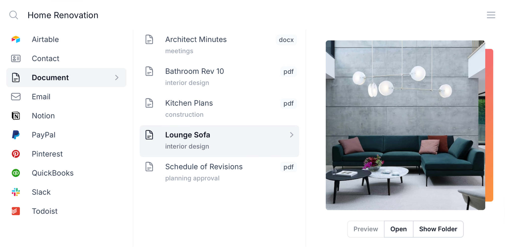

<h2 align="center">
Search everything, instantly.
</h2>

  

  <a href="https://github.com/harana/search/releases/download/untagged-234ca0734e38f9133293/harana-darwin-aarch64.dmg">macOS Apple</a> ·
  <a href="https://github.com/harana/search/releases/download/untagged-234ca0734e38f9133293/harana-darwin-x86_64.dmg">macOS Intel</a> ·
  Windows ·
  Linux
   
  <b>Alpha Release</b>. Expect bugs and crashes.

 

## Features

<b>Fast and Minimal</b>
* Search your desktop and the cloud in < 10ms.
* CPU usage and temperature aware.
* Offline - ideal for travellers and VPN users.

 

<b>Elegant Interface</b>
* 700+ file types recognised and categorised.
* Navigable entirely from keyboard.
* Information cards for showing thumbnail, file information and more.
* Instant preview for 15+ file types with more being added.

 

<b>Powerful Indexing</b>
* 100s of file types with custom indexing and thumbnail generation.
* PDF and Image OCR using Google Tesseract. 
* Text summarisation using Google Bert.
* Speech to text indexing for movies, podcasts etc using OpenAI Whisper.
* Video and image object detection using YOLO.
* Fallback to macOS Quicklook when needed. 

 

## Privacy

* We do not track your behaviour or capture any telemetry or user analytics.
* All searches and file indexing is done locally and never shared.
* Cloud sources are built server-side but are encrypted using your private key.
* We do use Sentry for crash reporting however this can be disabled.

 

## Roadmap

* Developer search e.g. Crates, NPM, Maven.
* Cloud search e.g. Airtable, Notion.
* Windows and Linux support.
* Kubernetes platform for running data services yourself.
* WebAssembly plugin SDK for indexing, thumbnail generation etc.
* AdaptiveCard support to allow publishing cards into Teams, Windows Feed etc.

 

## Developer Guide

Please refer to the [contributing guide](CONTRIBUTING.md) for how to install and contribute.

 

## Security Policy

Please refer to the [security policy](SECURITY.md) for information on how to responsibly report a security vulnerability or issue.

 

## Related

* [Search Engine](http://github.com/harana/search-engine) - Rust search core e.g. indexing, search, thumbnails
* [SBT Plugin](http://github.com/harana/sbt-plugin) - Scala SBT plugin abstracting common configuration
* [SDK](http://github.com/harana/sdk) - Scala SDK for the UI
* [Web](http://github.com/harana/web) - React / Scala.js related components

* [Platform](http://github.com/harana/platform) - Terraform workspaces/modules for the Data Platform
* [Platform Images](http://github.com/harana/platform-images) - Ansible/Packer playbooks for Docker images and AMIs
